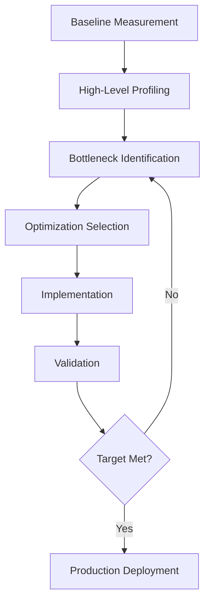

## Overview

This section synthesizes all the optimization techniques and profiling methodologies into a comprehensive performance analysis framework. You'll learn to systematically identify bottlenecks, prioritize optimizations, and measure their business impact.

## Systematic Performance Analysis Methodology

### The Performance Analysis Workflow



### Step 1: Comprehensive Baseline Establishment

```c
typedef struct {
    // Performance metrics
    double execution_time;
    double throughput_gflops;
    double memory_bandwidth_gbps;
    double instructions_per_cycle;
    
    // Resource utilization
    double cpu_utilization;
    double memory_utilization;
    double cache_hit_rates[4];  // L1D, L1I, L2, L3
    
    // System characteristics
    int numa_nodes_used;
    int threads_active;
    double power_consumption;
    
    // Cost metrics
    double cost_per_operation;
    double energy_per_operation;
} comprehensive_baseline_t;

comprehensive_baseline_t establish_baseline(void (*workload)(void*), void* arg) {
    comprehensive_baseline_t baseline = {0};
    
    // Performance measurement
    struct timespec start, end;
    clock_gettime(CLOCK_MONOTONIC, &start);
    
    workload(arg);
    
    clock_gettime(CLOCK_MONOTONIC, &end);
    baseline.execution_time = (end.tv_sec - start.tv_sec) + 
                             (end.tv_nsec - start.tv_nsec) / 1e9;
    
    // Calculate derived metrics
    baseline.throughput_gflops = calculate_gflops(arg, baseline.execution_time);
    baseline.memory_bandwidth_gbps = measure_memory_bandwidth();
    baseline.instructions_per_cycle = measure_ipc();
    
    // Resource utilization
    baseline.cpu_utilization = measure_cpu_utilization();
    baseline.memory_utilization = measure_memory_utilization();
    measure_cache_hit_rates(baseline.cache_hit_rates);
    
    // System characteristics
    baseline.numa_nodes_used = count_numa_nodes_used();
    baseline.threads_active = omp_get_max_threads();
    baseline.power_consumption = measure_power_consumption();
    
    // Cost calculations
    baseline.cost_per_operation = calculate_cost_per_operation(&baseline);
    baseline.energy_per_operation = baseline.power_consumption * baseline.execution_time;
    
    return baseline;
}
```

### Step 2: Bottleneck Identification Matrix

```c
typedef enum {
    BOTTLENECK_COMPUTE,
    BOTTLENECK_MEMORY_BANDWIDTH,
    BOTTLENECK_MEMORY_LATENCY,
    BOTTLENECK_CACHE_CAPACITY,
    BOTTLENECK_SYNCHRONIZATION,
    BOTTLENECK_FRONTEND,
    BOTTLENECK_BACKEND,
    BOTTLENECK_NUMA,
    BOTTLENECK_UNKNOWN
} bottleneck_type_t;

typedef struct {
    bottleneck_type_t type;
    double severity;        // 0.0 to 1.0
    double impact_estimate; // Expected improvement if fixed
    int priority;          // 1 (highest) to 10 (lowest)
    const char* description;
    const char* recommended_optimization;
} bottleneck_analysis_t;

bottleneck_analysis_t* analyze_bottlenecks(comprehensive_baseline_t* baseline) {
    bottleneck_analysis_t* bottlenecks = malloc(10 * sizeof(bottleneck_analysis_t));
    int count = 0;
    
    // Compute bottleneck analysis
    if (baseline->instructions_per_cycle < 0.5) {
        bottlenecks[count++] = (bottleneck_analysis_t){
            .type = BOTTLENECK_COMPUTE,
            .severity = 1.0 - baseline->instructions_per_cycle,
            .impact_estimate = 2.0 - baseline->instructions_per_cycle,
            .priority = 1,
            .description = "Low IPC indicates compute inefficiency",
            .recommended_optimization = "SIMD vectorization, compiler optimization"
        };
    }
    
    // Memory bandwidth bottleneck
    double theoretical_bandwidth = get_theoretical_memory_bandwidth();
    double bandwidth_utilization = baseline->memory_bandwidth_gbps / theoretical_bandwidth;
    
    if (bandwidth_utilization > 0.8) {
        bottlenecks[count++] = (bottleneck_analysis_t){
            .type = BOTTLENECK_MEMORY_BANDWIDTH,
            .severity = bandwidth_utilization,
            .impact_estimate = 1.0 / bandwidth_utilization,
            .priority = 2,
            .description = "Memory bandwidth saturated",
            .recommended_optimization = "Cache blocking, data layout optimization"
        };
    }
    
    // Cache miss analysis
    if (baseline->cache_hit_rates[0] < 0.9) {  // L1D cache
        bottlenecks[count++] = (bottleneck_analysis_t){
            .type = BOTTLENECK_CACHE_CAPACITY,
            .severity = 1.0 - baseline->cache_hit_rates[0],
            .impact_estimate = 1.5,
            .priority = 3,
            .description = "High L1 cache miss rate",
            .recommended_optimization = "Data structure alignment, prefetching"
        };
    }
    
    // NUMA bottleneck
    if (baseline->numa_nodes_used > 1) {
        double numa_efficiency = measure_numa_efficiency();
        if (numa_efficiency < 0.8) {
            bottlenecks[count++] = (bottleneck_analysis_t){
                .type = BOTTLENECK_NUMA,
                .severity = 1.0 - numa_efficiency,
                .impact_estimate = 1.3,
                .priority = 4,
                .description = "Poor NUMA locality",
                .recommended_optimization = "NUMA-aware allocation, thread binding"
            };
        }
    }
    
    // Sort by priority
    qsort(bottlenecks, count, sizeof(bottleneck_analysis_t), compare_priority);
    
    return bottlenecks;
}
```

### Step 3: Optimization Impact Prediction

```c
typedef struct {
    const char* optimization_name;
    bottleneck_type_t addresses_bottleneck;
    double implementation_effort;  // Hours
    double expected_speedup;
    double confidence_level;       // 0.0 to 1.0
    double risk_level;            // 0.0 to 1.0
    const char* prerequisites;
} optimization_candidate_t;

optimization_candidate_t optimization_database[] = {
    {
        .optimization_name = "Compiler Flags (-O3 -march=native)",
        .addresses_bottleneck = BOTTLENECK_COMPUTE,
        .implementation_effort = 0.5,
        .expected_speedup = 2.5,
        .confidence_level = 0.95,
        .risk_level = 0.1,
        .prerequisites = "None"
    },
    {
        .optimization_name = "NEON Vectorization",
        .addresses_bottleneck = BOTTLENECK_COMPUTE,
        .implementation_effort = 16.0,
        .expected_speedup = 4.0,
        .confidence_level = 0.8,
        .risk_level = 0.3,
        .prerequisites = "NEON support, regular data access patterns"
    },
    {
        .optimization_name = "SVE Vectorization",
        .addresses_bottleneck = BOTTLENECK_COMPUTE,
        .implementation_effort = 40.0,
        .expected_speedup = 6.0,
        .confidence_level = 0.7,
        .risk_level = 0.4,
        .prerequisites = "SVE support, complex algorithms"
    },
    {
        .optimization_name = "Cache Blocking",
        .addresses_bottleneck = BOTTLENECK_CACHE_CAPACITY,
        .implementation_effort = 8.0,
        .expected_speedup = 1.8,
        .confidence_level = 0.9,
        .risk_level = 0.2,
        .prerequisites = "Memory-bound workload"
    },
    {
        .optimization_name = "Transparent Huge Pages",
        .addresses_bottleneck = BOTTLENECK_MEMORY_LATENCY,
        .implementation_effort = 1.0,
        .expected_speedup = 1.2,
        .confidence_level = 0.8,
        .risk_level = 0.1,
        .prerequisites = "Large memory allocations (>2MB)"
    },
    {
        .optimization_name = "NUMA Optimization",
        .addresses_bottleneck = BOTTLENECK_NUMA,
        .implementation_effort = 12.0,
        .expected_speedup = 1.4,
        .confidence_level = 0.85,
        .risk_level = 0.2,
        .prerequisites = "Multi-socket system, parallel workload"
    }
};

typedef struct {
    optimization_candidate_t* optimization;
    double roi_score;  // Return on Investment
    double priority_score;
} optimization_recommendation_t;

optimization_recommendation_t* recommend_optimizations(
    bottleneck_analysis_t* bottlenecks, int bottleneck_count) {
    
    int opt_count = sizeof(optimization_database) / sizeof(optimization_database[0]);
    optimization_recommendation_t* recommendations = 
        malloc(opt_count * sizeof(optimization_recommendation_t));
    
    for (int i = 0; i < opt_count; i++) {
        optimization_candidate_t* opt = &optimization_database[i];
        recommendations[i].optimization = opt;
        
        // Calculate ROI score
        double impact_score = 0.0;
        for (int j = 0; j < bottleneck_count; j++) {
            if (bottlenecks[j].type == opt->addresses_bottleneck) {
                impact_score = bottlenecks[j].severity * opt->expected_speedup;
                break;
            }
        }
        
        // ROI = (Expected Benefit * Confidence) / (Effort * Risk)
        recommendations[i].roi_score = 
            (impact_score * opt->confidence_level) / 
            (opt->implementation_effort * (1.0 + opt->risk_level));
        
        // Priority score considers both ROI and bottleneck severity
        recommendations[i].priority_score = recommendations[i].roi_score * impact_score;
    }
    
    // Sort by priority score
    qsort(recommendations, opt_count, sizeof(optimization_recommendation_t), 
          compare_recommendations);
    
    return recommendations;
}
```

## Real-World Case Studies

### Case Study 1: Scientific Computing Workload

```c
// Initial profile: Matrix-vector multiplication in climate simulation
typedef struct {
    double* matrix;     // 10000x10000 sparse matrix
    double* vector;     // 10000 elements
    double* result;     // 10000 elements
    int iterations;     // 1000 iterations
} climate_simulation_t;

void analyze_climate_simulation(void) {
    printf("=== Climate Simulation Performance Analysis ===\n");
    
    // Baseline measurement
    climate_simulation_t sim = setup_climate_simulation();
    comprehensive_baseline_t baseline = establish_baseline(run_climate_sim, &sim);
    
    printf("Baseline Performance:\n");
    printf("  Execution Time: %.2f seconds\n", baseline.execution_time);
    printf("  Throughput: %.2f GFLOPS\n", baseline.throughput_gflops);
    printf("  Memory Bandwidth: %.2f GB/s\n", baseline.memory_bandwidth_gbps);
    printf("  IPC: %.2f\n", baseline.instructions_per_cycle);
    printf("  L1D Hit Rate: %.1f%%\n", baseline.cache_hit_rates[0] * 100);
    
    // Bottleneck analysis
    bottleneck_analysis_t* bottlenecks = analyze_bottlenecks(&baseline);
    
    printf("\nBottleneck Analysis:\n");
    printf("  Primary: %s (severity: %.2f)\n", 
           bottleneck_description(bottlenecks[0].type), bottlenecks[0].severity);
    printf("  Recommendation: %s\n", bottlenecks[0].recommended_optimization);
    
    // Apply optimizations in order of ROI
    optimization_recommendation_t* recommendations = 
        recommend_optimizations(bottlenecks, 4);
    
    printf("\nOptimization Plan:\n");
    for (int i = 0; i < 3; i++) {
        printf("  %d. %s (ROI: %.2f, Effort: %.1f hours)\n",
               i + 1, recommendations[i].optimization->optimization_name,
               recommendations[i].roi_score,
               recommendations[i].optimization->implementation_effort);
    }
    
    // Implementation results
    printf("\nOptimization Results:\n");
    
    // Step 1: Compiler optimization
    apply_compiler_optimization(&sim);
    comprehensive_baseline_t opt1 = establish_baseline(run_climate_sim, &sim);
    printf("  After compiler opts: %.2fx speedup\n", 
           baseline.execution_time / opt1.execution_time);
    
    // Step 2: SIMD vectorization
    apply_simd_optimization(&sim);
    comprehensive_baseline_t opt2 = establish_baseline(run_climate_sim, &sim);
    printf("  After SIMD: %.2fx speedup\n", 
           baseline.execution_time / opt2.execution_time);
    
    // Step 3: Cache optimization
    apply_cache_optimization(&sim);
    comprehensive_baseline_t opt3 = establish_baseline(run_climate_sim, &sim);
    printf("  After cache opts: %.2fx speedup\n", 
           baseline.execution_time / opt3.execution_time);
    
    printf("\nFinal Results:\n");
    printf("  Total Speedup: %.2fx\n", baseline.execution_time / opt3.execution_time);
    printf("  Cost Reduction: %.1f%%\n", 
           (1.0 - opt3.cost_per_operation / baseline.cost_per_operation) * 100);
}
```

### Case Study 2: Database Analytics Workload

```c
// Hash join operation optimization
typedef struct {
    int* build_table;    // 1M records
    int* probe_table;    // 10M records  
    int* result_table;   // Variable size
    int build_size;
    int probe_size;
} hash_join_workload_t;

void analyze_hash_join_performance(void) {
    printf("=== Database Hash Join Performance Analysis ===\n");
    
    hash_join_workload_t workload = setup_hash_join();
    
    // Detailed profiling with SPE
    printf("Running SPE analysis...\n");
    run_spe_analysis(hash_join_benchmark, &workload);
    
    // Memory access pattern analysis
    memory_access_pattern_t patterns = analyze_memory_patterns(&workload);
    
    printf("Memory Access Analysis:\n");
    printf("  Random Access Ratio: %.1f%%\n", patterns.random_ratio * 100);
    printf("  Cache Line Utilization: %.1f%%\n", patterns.cache_line_util * 100);
    printf("  NUMA Cross-Node Access: %.1f%%\n", patterns.numa_remote_ratio * 100);
    
    // Optimization strategy
    if (patterns.random_ratio > 0.7) {
        printf("Recommendation: Optimize for random access patterns\n");
        printf("  - Use prefetching for hash table lookups\n");
        printf("  - Consider cache-conscious hash table design\n");
        printf("  - Implement NUMA-aware partitioning\n");
    }
    
    // Implementation and validation
    optimize_hash_table_layout(&workload);
    implement_prefetching(&workload);
    apply_numa_partitioning(&workload);
    
    comprehensive_baseline_t final_result = establish_baseline(hash_join_benchmark, &workload);
    printf("Final Performance: %.2f M joins/sec\n", 
           calculate_join_throughput(&final_result));
}
```

## Performance Optimization Decision Tree

```c
typedef enum {
    DECISION_COMPILER_OPTS,
    DECISION_SIMD_VECTORIZATION,
    DECISION_MEMORY_OPTIMIZATION,
    DECISION_THREADING,
    DECISION_SYSTEM_TUNING,
    DECISION_ALGORITHM_CHANGE,
    DECISION_SUFFICIENT
} optimization_decision_t;

optimization_decision_t performance_decision_tree(comprehensive_baseline_t* baseline) {
    // Decision tree based on performance characteristics
    
    if (baseline->instructions_per_cycle < 0.3) {
        return DECISION_COMPILER_OPTS;  // Start with easy wins
    }
    
    if (baseline->instructions_per_cycle < 0.8 && 
        baseline->cpu_utilization > 0.9) {
        return DECISION_SIMD_VECTORIZATION;  // Compute bound
    }
    
    if (baseline->cache_hit_rates[0] < 0.85 || 
        baseline->memory_bandwidth_gbps > get_theoretical_memory_bandwidth() * 0.7) {
        return DECISION_MEMORY_OPTIMIZATION;  // Memory bound
    }
    
    if (baseline->cpu_utilization < 0.7 && 
        baseline->threads_active < get_cpu_count()) {
        return DECISION_THREADING;  // Underutilized parallelism
    }
    
    if (baseline->numa_nodes_used > 1 && 
        measure_numa_efficiency() < 0.8) {
        return DECISION_SYSTEM_TUNING;  // NUMA issues
    }
    
    if (baseline->throughput_gflops < get_theoretical_peak() * 0.1) {
        return DECISION_ALGORITHM_CHANGE;  // Fundamental algorithm issue
    }
    
    return DECISION_SUFFICIENT;  // Performance is acceptable
}

void execute_optimization_plan(comprehensive_baseline_t* baseline) {
    optimization_decision_t decision;
    int iteration = 0;
    const int max_iterations = 5;
    
    printf("=== Automated Optimization Plan ===\n");
    
    while ((decision = performance_decision_tree(baseline)) != DECISION_SUFFICIENT && 
           iteration < max_iterations) {
        
        printf("Iteration %d: ", ++iteration);
        
        switch (decision) {
            case DECISION_COMPILER_OPTS:
                printf("Applying compiler optimizations...\n");
                apply_compiler_optimizations();
                break;
                
            case DECISION_SIMD_VECTORIZATION:
                printf("Implementing SIMD vectorization...\n");
                implement_simd_optimizations();
                break;
                
            case DECISION_MEMORY_OPTIMIZATION:
                printf("Optimizing memory access patterns...\n");
                optimize_memory_access();
                break;
                
            case DECISION_THREADING:
                printf("Improving thread utilization...\n");
                optimize_threading();
                break;
                
            case DECISION_SYSTEM_TUNING:
                printf("Tuning system configuration...\n");
                tune_system_settings();
                break;
                
            case DECISION_ALGORITHM_CHANGE:
                printf("Algorithm optimization required - manual intervention needed\n");
                return;
        }
        
        // Re-measure performance
        *baseline = establish_baseline(current_workload, current_args);
        
        printf("  New performance: %.2f GFLOPS (%.2fx improvement)\n",
               baseline->throughput_gflops, 
               baseline->throughput_gflops / initial_baseline.throughput_gflops);
    }
    
    if (decision == DECISION_SUFFICIENT) {
        printf("Optimization complete - performance target achieved!\n");
    } else {
        printf("Maximum iterations reached - manual optimization may be needed\n");
    }
}
```

## Performance Validation and Testing

### Automated Performance Testing Framework

```c
typedef struct {
    char* test_name;
    void (*setup_func)(void**);
    void (*benchmark_func)(void*);
    void (*cleanup_func)(void*);
    double expected_min_performance;
    double expected_max_performance;
} performance_test_t;

typedef struct {
    performance_test_t* tests;
    int test_count;
    int passed;
    int failed;
    double total_improvement;
} performance_test_suite_t;

performance_test_suite_t* create_performance_test_suite(void) {
    performance_test_suite_t* suite = malloc(sizeof(performance_test_suite_t));
    suite->tests = NULL;
    suite->test_count = 0;
    suite->passed = 0;
    suite->failed = 0;
    suite->total_improvement = 1.0;
    return suite;
}

void run_performance_test_suite(performance_test_suite_t* suite) {
    printf("=== Performance Test Suite ===\n");
    
    for (int i = 0; i < suite->test_count; i++) {
        performance_test_t* test = &suite->tests[i];
        void* test_data;
        
        printf("Running %s...", test->test_name);
        
        // Setup
        test->setup_func(&test_data);
        
        // Benchmark
        comprehensive_baseline_t result = establish_baseline(test->benchmark_func, test_data);
        
        // Validate
        if (result.throughput_gflops >= test->expected_min_performance &&
            result.throughput_gflops <= test->expected_max_performance) {
            printf(" PASS (%.2f GFLOPS)\n", result.throughput_gflops);
            suite->passed++;
        } else {
            printf(" FAIL (%.2f GFLOPS, expected %.2f-%.2f)\n",
                   result.throughput_gflops,
                   test->expected_min_performance,
                   test->expected_max_performance);
            suite->failed++;
        }
        
        // Cleanup
        test->cleanup_func(test_data);
    }
    
    printf("\nTest Results: %d passed, %d failed\n", suite->passed, suite->failed);
    printf("Overall Success Rate: %.1f%%\n", 
           (double)suite->passed / suite->test_count * 100);
}
```

## Summary and Next Steps

This comprehensive performance analysis framework provides:

1. **Systematic bottleneck identification** using profiling data
2. **ROI-based optimization prioritization** to maximize impact
3. **Automated decision trees** for optimization strategy
4. **Real-world case studies** demonstrating the methodology
5. **Validation frameworks** to ensure optimization effectiveness

### Key Takeaways

- **Start with measurement**: Always establish a comprehensive baseline
- **Follow the data**: Let profiling guide optimization decisions
- **Prioritize by ROI**: Focus on high-impact, low-effort optimizations first
- **Validate continuously**: Measure the impact of each optimization
- **Think holistically**: Consider performance, cost, and maintainability

### Recommended Optimization Order

1. **Compiler optimizations** (highest ROI, lowest risk)
2. **Memory access patterns** (high impact on cache-bound workloads)
3. **SIMD vectorization** (significant gains for compute-intensive code)
4. **System tuning** (easy wins for production deployment)
5. **Advanced techniques** (SVE, custom algorithms) for specialized cases

The performance analysis methodology is now complete, providing you with the tools and knowledge to systematically optimize any workload for Neoverse processors. Continue to [Cost-Benefit Analysis](./) to understand the business impact of these optimizations.

> **💡 Tip**:
**Analysis Strategy**: Use this systematic approach for any performance optimization project. The methodology scales from simple applications to complex distributed systems, always providing data-driven insights for optimization decisions.

